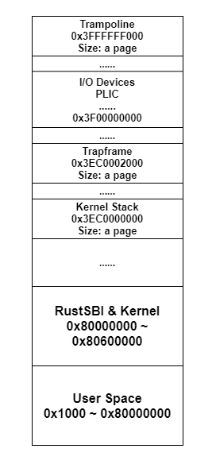

# **页表**
文档编写：AtomHeartCoder
<br>
<br>

# 页表映射策略

在 xv6-k210 这个较为简单的内核上，为了提高效率，我们取消了原本的用户、内核页表分离的规则，
将用户空间与内核空间合并在一个页表中。我们将用户空间的虚拟地址范围设置为 `0x1000` 至 `0x80000000` 这个范围内，
`0x80000000` 及以上是 `RustSBI` 和内核直接映射的空间，同时将物理地址在 `0x80000000` 以下的各类设备、
中断控制器的地址映射到了虚拟地址的高位，即 `trampoline` 之下，以将地址值释放给用户。对于不同的进程，
还需要其专属的寄存器现场 `trapframe` 和内核栈，它们的虚拟地址放在各类设备之下。整体的虚拟地址空间布局如下图。



这样，当从用户模式进入监管者模式时，就可以不用切换页表了。而且，当内核需要向用户空间读取或写入数据时，
也可以对用户提供的指针解引用进行访问，而不是像原本的方式，需要手动走页表找到对应的物理页后，再进行读写。
当然我们需要在用户空间对应的页表项上设置相关的用户标志位，在用户模式下，只能访问有用户标记的页，
因此用户不能访问 `0x80000000` 以上的地址；在内核中，需要设置 `sstatus` 寄存器中用户保护位 `PUM` (RISC-V 1.9.1)，
以免内核误访问用户空间，只有在需要访问用户空间时，才暂时取消保护。

实际上，页表中并不映射 `RustSBI` 的空间，因为内核不需要、也不应该直接访问 M 态中的内容。

# 页表的管理

当内核初始化完毕后，内核中只存在一份页表，这个页表中只包含了内核代码与数据、各种外设和跳板页 `Trampoline`，
当然也包括启动时使用的内核栈，实际上这个栈是在 BSS 段中的（见 `entry_k210/qemu.S`）。
而在后续初始化进程后， 进程使用的页表只是多出了用户空间的映射，以及进程内核栈、寄存器现场 `Trapframe`，
其他部分与最初的内核页表是完全一样的。因此，我们没有必要再为这些部分建立页表空间，而是想办法复用这一部分的内容。

Xv6-k210 使用 Sv39 的虚拟地址映射机制，有三级页表。用户空间 `0x1000` 至 `0x80000000` 在第二级页表
（即根页表，我们将页表从根至叶分为第二、第一、第零级）中，完全占用两个页表项，即前两个页表项，
而初始内核页表中的这两项是空的，那么我们就可以利用这一点。在为进程创建页表时，不需要完全创建，而是只申请一个页，
作为根页表，并将初始内核页表中的内容完全复制过来就可以了。此外，进程还需要一个内核栈和一个寄存器现场页，
那么只需要在根页表中再找一个空区域进行映射就可以了，这也是我们设置其虚拟地址的依据。

总体上看，不同进程之间，只有根页表、用户部分的第一和第零级页表、栈和寄存器现场的第一和第零级页表是不同的，
其他部分复用。整个页表映射的全局视图如下图所示。当然，这里只是逻辑上虚拟地址的示意图，除了 RustSBI 这一部分，
内核页表对所有的物理页都有直接映射。


## `fork()` 中的页表操作

创建子进程时，需要申请一个新的页表。这个页表由 `vm.c` 中的 `kvmcreate()` 函数提供，其复制了内核初始页表的内容，
并添加了内核栈的映射，该页和内核栈都是即时分配的。随后，`fork()` 将 `trapframe` 添加至该页表中，最后，
复制添加父进程中用户空间的内容，即 `0x1000` 至 `0x80000000` 中的内容。这就完成了页表的复制。

## `exec()` 中的页表操作

与 `fork()` 有所不同，`exec()` 是将当前进程变为目标进程，需要新建一个页表，并销毁原来的页表。在这个过程中，
可能发生各种原因导致失败，如目标 ELF 文件非法、载入时内存不足或是程序的初始参数过大导致栈溢出等。当执行失败时，
`exec()` 需要能正确返回，也就是说，当前进程的页表需要保留到最后，才能被释放，但这个释放与一般的过程有所不同。

`exec()` 过程中，新进程的页表不是从 `kvmcreate()` 获得，而是直接复制原进程的页表（根页表）。这是因为，
对于硬件线程（即一个 hart）来说，该过程前后并没有发生上下文的切换，而内核上下文保存在内核栈中。对于 `fork()`，
子进程的上下文与父进程无关，因此需要新的栈，而 `exec()` 则需要同一个内核上下文，因此不能切换内核栈。所以，
目标进程直接复制原进程的页表即可，当然，还需要把根页表中用户空间对应的前两个页表项擦除，重新分配页表的用户部分。
一旦成功，再将原页表中的用户部分连同映射的物理页释放，最后释放原先的根页表。这里，新进程使用了原进程的内核栈、
用户寄存器上下文，需要重新设置新进程的寄存器上下文。

# 页表相关的设施

## 写时复制 Copy-On-Write (COW)

在不少情况下，用户进程在 `fork()` 后，会紧接着调用 `exec()`，此时进程克隆时分配、拷贝的工作就显得有些多余。
为了减小这种浪费，我们为 xv6-k210 提供了写时复制的克隆机制。

在进程克隆时，不分配新的物理页和拷贝父进程的内容，而是直接将父进程的物理页映射到子进程的页表中，
让两个进程共享其中的内容。但由于进程之间的数据不是共享的，当其中一个进程写内存时，不应当让相关进程看到这一动作，
此时，才需分配一个新的页并拷贝原页中的内容，这就是写时复制。

在 RISC-V 的页表项格式中有两个为 S 态软件保留的位，可以利用这个设定，在拷贝父进程页表时，若父进程页表项中有写权限，
则取消该权限，并在父子进程的两个页表项的保留位上做标记。当其中一个进程进行写操作时，会触发页写入异常（在 1.9.1 中，
只有页访问异常，而新版本的 RISC-V 标准中则进一步细分了页权限异常和页读写异常），内核判断对应页表项中是否被做了标记，
也就是判断这个页原本是否可写，若可写，且该进程不是最后一个占用该页的进程，则为其分配一个页；若进程为唯一占用者，
则直接把页表项的写权限置位，让该进程完全占用该页。

为了实现这样的机制，最简单的做法就是使用一个引用计数表，记录各个物理页的用户引用计数，为相关异常处理提供依据。

## 懒惰分配 Lazy-Allocation

同样的，有时用户程序会像内核请求大量物理空间，但实际上并没有使用这么多，从而造成浪费。当用户进程请求扩展其堆空间时，
内核只需要判断其需求的合理性，即是否负向越过堆底，或正向碰撞栈顶，如果合理，那么就简单地改变该进程的堆空间记录即可，
当用户正真访问其堆空间时，由于页表上缺少映射，会引发异常，这时才真正为其分配物理页。

## 页异常的处理

发生页异常时，内核首先通过 `stval` 寄存器得到用户访问的地址，接着查询进程的段管理结构，判断该地址是否属于用户空间，
若是，则获取对应的页表项，如果该页表项存在且有写时复制标记，则按写时复制策略处理；否则，若该地址属于堆段，
则按懒惰分配机制处理，再否，则表明是一个真正的异常。

## 一些问题

虽说写时复制和懒分配对用户程序来说是透明的，但它们确实会给用户程序带来一些影响。首先假定，在某一内存不足的情况下，
按照普通的策略响应用户的系统调用时，会返回失败，这时用户程序可以自行处理失败的情况；但是，在写时复制和懒分配下，
却可能返回成功，则用户程序按照请求成功的情况继续执行。而当用户真正需要这些页时，内核却可能无法提供，只能终止其执行，
这对于用户来说是糟糕的。这个问题可以通过实现页交换机制解决，但这或许不是目前工作的重点。

# 内核在用户空间上的险象

从以上所描述的页表相关策略中，或许可以注意到一些问题。当一个用户进程发生页异常时，会陷入至内核中，由内核进行处理。
如果是由写时复制或懒惰分配引发的异常，内核会扩展进程的页表并分配物理页。在这一过程中，如果由于内存不足导致分配失败，
那么内核只需终止用户进程即可，这不会对内核产生任何影响。但是，在某一情况下，我们所引入的各种“偷懒”机制，
会给我们带来一个问题。

我们将用户页表与内核页表合并后，内核可以直接通过用户虚拟地址访问用户空间，也就是使用硬件 MMU 替代了软件走页表。
当用户请求系统调用时，内核会读写用户提供的地址中的内容，而这个地址，可能处在写时复制标记的页，或处在懒惰分配范围内、
但未建立页表映射的不存在的页，异常会被引发。读写操作最终调用的是 `memmove()` 函数，本质上是一个循环访存过程。

在内核进行操作前，已经判断了地址的合法性，但请考虑以下情况：直接读写用户空间时，处于内核态，如果触发异常，
则尝试分配页，若成功则返回异常断点处，即某条 `load` 或 `store` 指令，并重新执行。但是，如果内存不足，分配失败，
事情就有些复杂了。

如果用户态发生这一异常，则内陷至内核（通过 `uservec()` 进入 `usertrap()`）并直接进入异常处理，即使处理失败，
也不影响内核的上下文。但在上述情况中，异常是在内核中处理系统调用时发生的，异常断点处是一条 `load` 或 `store` 指令，
异常发生后内核通过 `kernelvec()` 进入 `kerneltrap()`，无论处理结束如何，都会返回断点重新执行。显然，
内核会回到引起异常的访存指令处重新执行，然而这又会重新引起异常，因为这个页还是没有被正确设置。

更糟糕的是，由于是处理系统调用，内核此时已经处在一个较深的函数调用栈中。不同于用户进程，内核的执行上下文不该、
也无法被终止。而且，在当前的函数调用栈中，内核可能已经获取了一些锁，要让内核能够继续运行，必须原路返回以释放相关资源。

如何返回呢？我们采用这样的一个简单解决方案：在进入可能发生险象的代码片段前，设置当前状态为安全，并建立一个存档点；
如果险象发生，即异常处理失败，则获取这个存档点，并将状态设置为危险；在这种情况下，在异常处理中将 `sepc` 设置为存档点，
就能从险象中脱离，仿佛让时光倒流了。但此时，我们还拿到了来自“未来的信息”——状态变成了危险，那么内核就可以终止操作，
返回一个失败值即可。

为此，我们设计了一个安全版的内存拷贝函数 `safememmove()`。在我们的设定下，所有内核对用户空间的访问最终都会调用该函数。
因此，也只有在函数中可能发生险象，更确切地说，当由于页异常而进入 `kerneltrap()` 时，该函数是唯一的原因，
页异常处理失败时获取的存档点不会存在歧义。

具体的设计在 `vm.c` 中实现。
```C
// back to this point when fail to handle a page fault
static uint64 save_point = 0;
static uint8 safe_state[NCPU];  // avoid races

// a page fault failed to handle, kerneltrap() calls this for help
uint64 kern_pgfault_escape()
{
	safe_state[r_tp()] = 0; // set unsafe for tht current hart
	return save_point;
}

static void set_safe_state(void)
{
	safe_state[r_tp()] = 1;
}

static int get_safe_state(void)
{
	return safe_state[r_tp()];
}

// either dst or src is from user space
static int safememmove(void *dst, const void *src, uint len)
{
	char *dst_s = (char *)dst;
	char *src_s = (char *)src;
	int ret = 0;

	set_safe_state();                   // set current state safe

	uint64 safe_pc;
	asm volatile("auipc %0, 0x0" : "=r" (safe_pc)); // get save point
	if (!save_point) {                  // a global variable
		save_point = safe_pc;
	}

	if (get_safe_state() == 1) {
		permit_usr_mem();               // disable PUM in sstatus
		while (len--) {
			*dst_s++ = *src_s++;        // this may raise a page fault
		}
		ret = 1;
	}

	ret--;
	protect_usr_mem();                  // set PUM in sstatus
    return ret;                         // success on 0, failure on -1
}
```
在 `trap.c` 的 `kerneltrap()` 中请求存档点以脱离险象：
```C
void kerneltrap()
{
	uint64 sepc = r_sepc();
	uint64 sstatus = r_sstatus();
	uint64 scause = r_scause();

	struct proc *p = myproc();
	protect_usr_mem();

	if (0 == handle_intr(scause)) {
        ...
	}
	else if (0 == handle_excp(scause)) {
		// handle exceptions successfully
	}
	else if (p && is_page_fault(scause) && NULL != r_stval()) {
		sepc = kern_pgfault_escape(); // set sepc
	}
	else {
		...
	}
	w_sepc(sepc);
	w_sstatus(sstatus);
}
```
需要说明的是，在 `safememmove()` 中，状态的获取需要通过函数完成，而不是直接访问变量。因为编译器可能会优化这一过程，
使得在获取存档点前，状态值就已被载入到寄存器中，即使在异常处理中修改了内存中的值，回到断点处后，
依然只会根据实际指令访问寄存器中的值，而不是去内存中获取最新的值。

理想的方法是直接使用标号来标记存档点，而不是通过 `auipc` 指令获得。但 C 语言在设计上只允许标号在局部可见，遂放弃。
我也尝试通过内联汇编声明一个全局标号，但无法通过编译，也放弃了。最后才想出以上方法。

**更新**  
这里通过全局变量来保存状态的做法是有一些问题的。
```C
static uint8 safe_state[NCPU];
```
设想这样的情况：从异常中返回后，中断是使能的，如果异常处理失败，且在获取状态前来了时钟中断，那么就可能引起调度，
后续进程有可能会覆盖其安全状态。现在的做法是将状态保存在进程控制块中，使得状态以进程为单位进行保存，而非 cpu。
```C
...
asm volatile("auipc %0, 0x0" : "=r" (safe_pc));		<= 从异常中返回
if (!save_point) {									\
	save_point = safe_pc;							 |-- 可能收到中断
}													/
if (get_safe_state() == 1) {						<= 获取状态
	...
}
...
```
进一步考虑，即使真的出现状态被覆盖的情况，结果无非就是再重新执行一次，或许会再引发一次异常并进行处理。比较需要担忧的是，
我们不知道编译器会如何组织该函数的指令序列，直接返回存档点可能会使得寄存器中的值与原先不一致。例如：
```asm
ld		a1, xxx		# 某个地址
auipc	t1, 0x0		# 存档点
ld		s1, 0(a1)	# 通过 a1 寻址
...
add		a1, t1, a1	# 这里修改了 a1 中的值
sd		a1, 0(s1)	# 假设该访存指令引起异常		
```
从这里可以看到，引起异常后返回存档点时，`a1` 中的值就不是正确的结果。这也是状态的获取需要通过函数完成的另一原因，
无论如何返回值都是更新在 `a0 ` 寄存器中的。或许也可以通过一些属性声明，通知编译器不对该函数进行优化，以减少错乱产生的可能。
