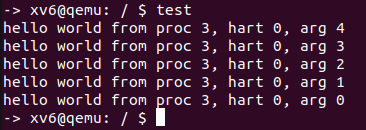

# 如何在xv6-k210中添加syscall

了解了Syscall在xv6-k210中的执行过程，为系统添加一个新的syscall功能就不是什么难事了。添加新系统调用的步骤如下：

1. 在xv6-user目录下
    + 在user.h文件中，添加新系统调用封装后的函数声明，假设其函数名为`mysyscall`。
    + 在usys.pl文件末尾，添加如下行：

        ```perl
        ......
        entry("mysyscall");
        ```

2. 在kernel目录下
    + 在include/sysnum.h文件中，添加新系统调用号的宏定义：

        ```C
        ......
        #define SYS_mysyscall ?
        ```

        其中，“?”为新的合法系统调用号，本质上是一个数组下标，可根据需要设置，建议按顺序递增添加。

    + 在syscall.c文件中，添加功能函数的声明，并更新系统调用表：

        ```C
        ......
        extern uint64 sys_mysyscall(void);

        static uint64 (*syscalls[])(void) = {
            ......
            [SYS_mysyscall]    sys_mysyscall,
        };

        ```
3. 根据该系统调用的功能，选择一个适合的内核模块的源文件，在其中实现`sys_mysyscall`函数的功能。
    例如，与文件相关的系统调用可以在kernel/sysfile.c中添加。
    可以利用syscall.c文件中提供的相关函数，在`sys_mysyscall`中获取用户进程传递的参数。

下面给出一个更具体的例子。在我们的移植工作中，我们需要测试用户进程的运行，使其向屏幕进行输出。
但当时用户态尚未支持`printf`函数，我们便通过系统调用，在S态进行一些输出。
为此，我们需要添加一个`test_proc`函数，其需要一个整型参数。

首先，我们在xv6-user/user.h文件中添加函数声明，为用户程序添加调用接口：
```C
int test_proc(int);
```
在xv6-user/usys.pl中添加行:
```perl
entry("test_proc");
```
随后修改内核，在kernel/include/sysnum.h中添加调用号，调用号可以自行选择，这里我们选择22，表示第22个系统调用。
```C
#define SYS_test_proc 22
```
最后，在kernel/include/syscall.c中修改系统调用表，以及添加函数`sys_test_proc`。注意，这里需要声明为无参数类型。
```C
extern uint64 sys_test_proc(void);

static uint64 (*syscalls[])(void) = {
    ......
    [SYS_test_proc]    sys_test_proc,
};
```
函数的实现如下。其中`argint`函数可以从进程的保护现场中取得参数，第一个参数表示系统调用的第几个参数，从0开始编号。
```C
uint64 sys_test_proc(void) {
    int n;
    argint(0, &n);
    printf("hello world from proc %d, hart %d, arg %d\n", myproc()->pid, r_tp(), n);
    return 0;
}
```
至此，我们就已经成功添加了一个系统调用。在用户程序中可以使用这个系统调用，例如以下的用户程序实例：
```C
#include "kernel/include/types.h"
#include "kernel/include/sntat.h"
#include "xv6-user/user.h"

int main()
{
    int n = 5;
    while (n--) {
        test_proc(n);
    }
    exit(0);
}
```
编译运行后的结果如下图所示（编译用户程序的方法详见[此处](./fs.md)）：




<br>
<br>
